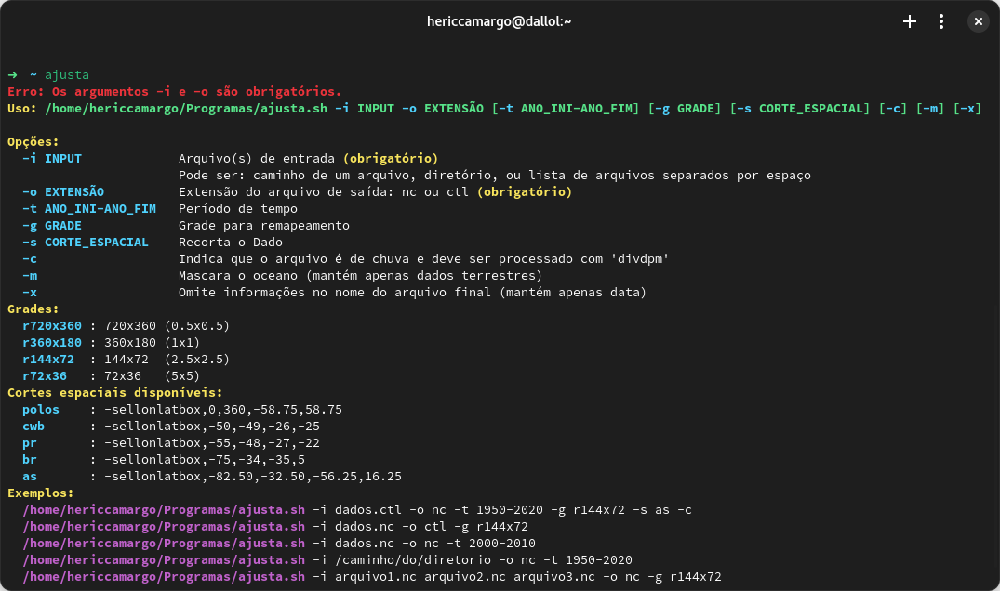

# Ajusta.sh - Ajusta arquivos .nc e .ctl

Um script Bash para processar, recortar e remapear dados em formato NetCDF (.nc) e controle (.ctl) por latitude, longitude, período e grade.



## Descrição

`ajusta.sh` permite operações como:

- Recorte por regiões geográficas pré-definidas
- Remapeamento para diferentes resoluções de grade
- Filtro por períodos específicos de anos
- Processamento especial para dados de chuva
- Mascaramento de oceano (mantém apenas dados terrestres)
- Conversão entre formatos NetCDF e controle

Este script foi originalmente desenvolvido por Lucas Lopes e modificado por mim.

## Requisitos

- CDO (Climate Data Operators)
- Bash
- Acesso ao script `/geral/programas/converte_nc_bin/converte_dados_nc_to_bin.sh` para conversão de NetCDF para formato binário/controle

## Uso

```bash
./ajusta.sh -i INPUT -o EXTENSÃO [-t ANO_INI-ANO_FIM] [-g GRADE] [-s CORTE_ESPACIAL] [-c] [-m] [-x]
```

### Argumentos obrigatórios

- `-i INPUT`: Arquivo(s) de entrada. Pode ser:
  - Caminho para um arquivo individual
  - Caminho para um diretório (processará todos os arquivos .nc e .ctl)
  - Lista de arquivos separados por espaço
- `-o EXTENSÃO`: Extensão do arquivo de saída: `nc` ou `ctl`

### Argumentos opcionais

- `-t ANO_INI-ANO_FIM`: Período de tempo para recortar os dados (ex: 1950-2020)
- `-g GRADE`: Grade para remapeamento
- `-s CORTE_ESPACIAL`: Recorte espacial pré-definido
- `-c`: Indica que o arquivo contém dados de chuva e deve ser processado com 'divdpm'
- `-m`: Mascara o oceano (mantém apenas dados terrestres)
- `-x`: Omite informações extras no nome do arquivo final (mantém apenas data)

## Grades disponíveis

- `r720x360`: 720x360 (0.5° x 0.5°)
- `r360x180`: 360x180 (1° x 1°)
- `r144x72`: 144x72 (2.5° x 2.5°)
- `r72x36`: 72x36 (5° x 5°)

## Cortes espaciais disponíveis

- `as`: América do Sul (-82.50,-32.50,-56.25,16.25)
- `polos`: Exclui polos (-58.75,58.75)
- `pr`: Paraná (-55,-48,-27,-22)
- `br`: Brasil (-75,-34,-35,5)
- `cwb`: Curitiba (-50,-49,-26,-25)

## Exemplos

```bash
# Processa um arquivo, converte para NetCDF, recorta para período 1950-2020, 
# remapeia para grade 2.5x2.5, aplica corte para América do Sul, e processa como chuva
./ajusta.sh -i dados.ctl -o nc -t 1950-2020 -g r144x72 -s as -c

# Converte um arquivo NetCDF para formato de controle e remapeia
./ajusta.sh -i dados.nc -o ctl -g r144x72

# Recorta um arquivo NetCDF para período específico
./ajusta.sh -i dados.nc -o nc -t 2000-2010

# Processa todos os arquivos em um diretório
./ajusta.sh -i /caminho/do/diretorio -o nc -t 1950-2020

# Processa múltiplos arquivos específicos
./ajusta.sh -i arquivo1.nc arquivo2.nc arquivo3.nc -o nc -g r144x72
```

## Saída

O script gera arquivos de saída com nomenclatura que indica as operações realizadas:
- Nome original do arquivo
- Período temporal (se especificado)
- Grade utilizada (se especificada)
- Corte espacial (se especificado)
- Sufixo `_chuva` (se processado com -c)
- Sufixo `_land` (se mascarado oceano)

Use a opção `-x` para simplificar a nomenclatura, mantendo apenas as informações de período.

## Logs

Para arquivos de saída no formato .ctl, o script anexa automaticamente informações de log detalhando as operações realizadas.

## Adicionando novas regiões de corte

Para adicionar novas regiões de corte espacial, edite o script e adicione entradas ao array associativo `CORTES_ESPACIAIS`:

```bash
CORTES_ESPACIAIS["nome_novo"]="-sellonlatbox,lon_min,lon_max,lat_min,lat_max"
```
